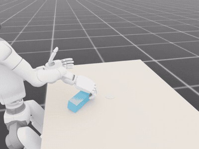
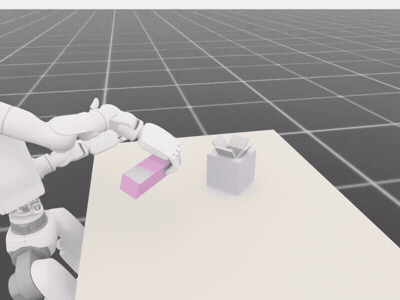
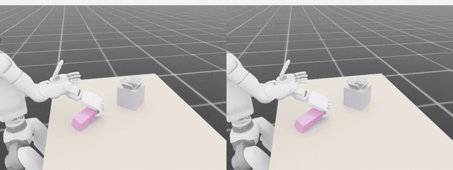

# ParcelStow

Task-rate robustness evaluation for learned dexterous manipulation.

[](https://huggingface.co/datasets/cenwerem/parcelstow)
[](https://arxiv.org/abs/2609.01453)

ParcelStow compares an imitation policy with the expert that generated its
demonstrations as task execution speed changes. At each speed, the expert and
policy receive matched initial conditions and use the same task geometry,
success predicates, state observation, and joint-position action interface.
This comparison separates sensitivity to execution speed from a difference in
evaluation conditions.

The release contains three contact-rich manipulation tasks for a fixed-base
Unitree G1 humanoid with a RealHand L6 right hand. Each task has a scripted
expert, a speed range fixed by calibration performed before learner training,
demonstrations sampled from that range, a trained ACT policy, episode records,
and success predicates evaluated from simulator state.

| Task | Physical Requirement | Demonstrated Speed Range | Frozen Specification |
|---|---|---:|---|
| Parcel insertion | Acquire and reorient an 80 × 55 × 40 mm parcel, then insert it into a receptacle with 10 mm of clearance per side along the tight axis | $r \in [0.5, 2.0]$ | [Parcel Insertion](docs/TASK_SPEC.md) |
| Upright placement | Stand a 180 × 55 × 55 mm cuboid on a marked target region and retain it there after release | $r \in [0.75, 1.75]$ | [Upright Placement](docs/TASK_SPEC_UPRIGHT.md) |
| Keyed peg insertion | Reorient the same cuboid and insert it into a square pocket with 3 mm of clearance per side | $r \in [0.5, 1.0]$ | [Keyed Peg Insertion](docs/TASK_SPEC_PEG.md) |

The speedup factor $r$ divides the nominal durations of each task's designated
manipulation phases. The acquisition and final settling phases retain fixed
durations, and each policy observes $r$. Evaluation within the demonstrated
range tests performance at speeds represented in the training data;
evaluation outside that range tests speed extrapolation. [Benchmark
Specification](docs/BENCHMARK.md) defines the intervention, matched evaluation,
and statistical reporting used for the original parcel insertion study.

## Outline

- [Representative Results](#representative-results)
- [Released Tasks](#released-tasks)
- [Quick Start](#quick-start)
- [Installation](#installation)
- [Evaluate Your Own Policy](#evaluate-your-own-policy)
- [Repository Map](#repository-map)
- [Benchmark Specification](docs/BENCHMARK.md)
- [Policy Interface](docs/POLICY_INTERFACE.md)
- [Reproducing Our Paper's Results](docs/REPRODUCING_THE_PAPER.md)
- [Data and Checkpoints](docs/DATA_AND_CHECKPOINTS.md)
- [Diagnostics](docs/DIAGNOSTICS.md)
- [Citation](#citation)

## Representative Results

### Orientation Error at the Maximum Demonstrated Speed

ACT-A succeeds in all 100 episodes at nominal speed. In the
`r=2` episode shown below, ACT-A finishes with a 17.1 degree orientation error,
which exceeds the 10 degree settling tolerance.

<table align="center">
  <tr>
    <td align="center">
      
      <br>
      <p align="justify"><sub><b>Comparing Expert-Learner Insertion Performance at the Maximum Demonstrated Speed. </b>Terminal states at $r=2$, with the receptacle interior magnified. Each subcaption reports the final parcel orientation error for the displayed episode; successful settling requires an error of at most 10 degrees. The panels show separate episodes, not outcomes from a shared initial condition.</sub></p>
    </td>
  </tr>
</table>

### Success Rate Versus Execution Speed

The expert and ACT-A each succeed in 100 of 100 episodes at nominal speed.
At $r=2$, the maximum demonstrated speed, the expert succeeds in 84 episodes
and ACT-A succeeds in 53. Their success rates differ by 31 percentage points;
a paired bootstrap gives a 95% confidence interval of $[0.18, 0.44]$ for this
difference. ACT-B and ACT-C also lose more success than the expert between
$r=1$ and $r=2$, but neither matches the expert at nominal speed.

<table align="center">
  <tr>
    <td align="center">
      
      <br>
      <p align="justify"><sub><b>Success Rate Versus Execution Speed. </b>Each point represents 100 episodes and includes a Wilson 95% confidence interval. Speeds above $r=2$ lie outside the demonstrated range. The paper reports the stage outcomes, relative motion handoff, and force closure analyses; <a href="docs/DIAGNOSTICS.md">Diagnostics</a> defines the corresponding measurements.</sub></p>
    </td>
  </tr>
</table>

## Released Tasks

Upright placement and keyed peg insertion extend the matched comparison beyond
the original parcel insertion task. Upright placement tests stability after
release on a target region. Keyed peg insertion tests transport and insertion
through a clearance of 3 mm per side. Their frozen specifications precede
learner training, and their episode records are released under
[`data/records/upright/`](data/records/upright/) and
[`data/records/peg/`](data/records/peg/).

<table align="center">
  <tr>
    <td align="center">
      
      <br>
      <p align="justify"><sub><b>Upright Placement. </b>The scripted expert stands the 180 mm cuboid on the marked target region at $r=1$; the expert succeeds in 92 of 100 evaluation episodes at this speed.</sub></p>
    </td>
    <td align="center">
      
      <br>
      <p align="justify"><sub><b>Keyed Peg Insertion. </b>The scripted expert inserts the same cuboid into a square pocket with 3 mm of clearance per side at $r=1$; the expert succeeds in 94 of 100 evaluation episodes at this speed.</sub></p>
    </td>
  </tr>
</table>

<table align="center">
  <tr>
    <td align="center">
      
      <br>
      <p align="justify"><sub><b>Expert-Learner Contrast at Nominal Speed. </b>At $r=1$, the expert (left) guides the peg through the funnel, while the ACT policy (right) drops it during transport. Across 100 matched evaluation episodes, the expert succeeds 94 times and ACT succeeds 76 times. At each evaluated speed $r \geq 1.5$, which lies above the demonstrated range, ACT acquires the peg in 0 of 100 episodes.</sub></p>
    </td>
  </tr>
</table>

## Quick Start

**Tier 0, no Isaac Lab, no GPU**

The repository contains the episode records for all three tasks. Reproduce the
parcel insertion success curve, success table, and paired bootstrap interval,
then regenerate the upright placement and keyed peg insertion curves, with

```bash
python3 -m pip install numpy matplotlib
python3 scripts/reproduce.py envelope
python3 scripts/plot_envelope.py --summary data/records/upright/eval_summary.jsonl \
    --actors expert act --out outputs/upright_operating_envelope
python3 scripts/plot_envelope.py --summary data/records/peg/eval_summary.jsonl \
    --actors expert act --out outputs/peg_operating_envelope
```

**Tier 1, First Parcel Insertion Simulator Run**

With Isaac Lab installed (see [Installation](#installation)), run the scripted expert for five
episodes,

```bash
python scripts/run_task.py
```

**Tier 2, Run a Released Parcel Insertion Policy**

Evaluate the ACT-A checkpoint, fetched from the [Hugging Face
dataset](https://huggingface.co/datasets/cenwerem/parcelstow), at two speeds:

```bash
python scripts/download_artifacts.py --demo     # ACT-A checkpoint
python scripts/evaluate.py --actor act --rates 1.0 2.0 --episodes 100
```

**Tier 3, Full Reproduction**

Retrieve the demonstrations and checkpoints from the consolidated [Hugging
Face dataset](https://huggingface.co/datasets/cenwerem/parcelstow), then follow
[Reproducing the Paper](docs/REPRODUCING_THE_PAPER.md). The evaluation drivers
for the two additional tasks are
`scripts/manipulation/eval_upright_policies.py` and
`scripts/manipulation/eval_peg_policies.py`.

## Installation

The analysis tier needs Python 3.10+ with numpy and matplotlib. The
simulation tiers need [Isaac Lab](https://isaac-sim.github.io/IsaacLab/)
(tested with Isaac Sim 5.1). Install the task extension into the Isaac
Lab Python environment,

```bash
uv pip install -p <isaaclab-venv>/bin/python -e source/parcelstow
```

then run the geometry and simulator-backed physics tests,

```bash
python -m pytest tests/ -q            # pure geometry tests, no simulator
python -m pytest tests/ --isaac -q    # simulator-backed physics tests
```

## Evaluate Your Own Policy

Implement three members, `name`, `reset(ids, obs)`, and
`act(obs) -> (action, q_target)`, over the frozen 147-D state observation
(speedup factor included at index 146) and 16-D joint-position action at
50 Hz. `examples/custom_policy.py` is a complete runnable example,

```bash
python scripts/evaluate.py --actor examples.custom_policy:HoldPosturePolicy \
    --rates 1.0 --episodes 5 --num_envs 8
python scripts/plot_envelope.py --summary outputs/eval/summary.jsonl
```

[docs/POLICY_INTERFACE.md](docs/POLICY_INTERFACE.md) documents the
observation slices, action semantics, reset protocol, and record schema.

## Repository Map

| Path | Content |
|---|---|
| `scripts/run_task.py`, `evaluate.py`, `plot_envelope.py`, `reproduce.py`, `download_artifacts.py` | supported public commands |
| `source/parcelstow/` | Isaac Lab environments, task geometry, phase schedules, and success monitors |
| `scripts/manipulation/` | experiment drivers for parcel insertion, upright placement, and keyed peg insertion |
| `examples/custom_policy.py` | minimal policy showing the integration point |
| `data/records/` | released episode evaluation records |
| `experiments/paper/results/` | frozen derived analyses of the paper |
| `artifacts/manifest.json` | external file inventory with checksums |
| `docs/` | benchmark spec, task spec, interface, reproduction, diagnostics |
| `tests/` | pure geometry tests and simulator-backed physics tests |

## Citation

The accompanying preprint is
[arXiv:2609.01453](https://arxiv.org/abs/2609.01453) \[cs.RO\].

```bibtex
@misc{enwerem2026parcelstow,
  title  = {Does Imitation Learning Preserve Temporal Robustness in Dexterous
            Manipulation? An Expert-Learner Comparison Across Task Execution Speeds},
  author = {Enwerem, Clinton and Baras, John S. and Belta, Calin},
  year   = {2026},
  eprint = {2609.01453},
  archivePrefix = {arXiv},
  primaryClass = {cs.RO},
  url    = {https://arxiv.org/abs/2609.01453}
}
```
