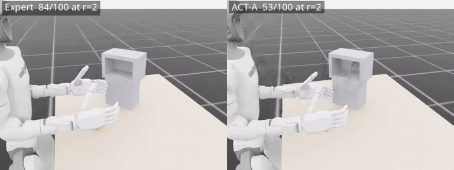

# ParcelStow

Task-rate robustness evaluation for learned dexterous manipulation.

ParcelStow is an Isaac Lab benchmark for measuring whether learned
contact-rich manipulation policies preserve task success as execution
rate increases while task geometry and acquisition timing remain fixed.
A humanoid arm-hand system acquires a small parcel, reorients it by
90 degrees, and inserts it into a cubby with 10 mm clearance. The single
controlled variable is the task rate r, the requested speed of the
demonstrated manipulation cycle, visible to every policy in its
observation.



**The primary result.** The scripted expert and an ACT policy trained on
its demonstrations both succeed 100/100 at the nominal rate. At r=2,
still inside the ACT training-rate range [0.5, 2],

| | r=1 | r=2 |
|---|---|---|
| Expert | **100/100** | **84/100** |
| ACT-A | **100/100** | **53/100** |

with a paired bootstrap 95% interval of [0.18, 0.44] for the success gap
at r=2 on shared evaluation draws. ACT-B and ACT-C degrade more from r=1
to r=2 than the expert as well. Nominal task reproduction and
preservation of the demonstrated physical operating envelope are
different properties, and ParcelStow measures the second.


| | | |
|---|---|---|
| [Quick start](#quick-start) | [Evaluate your policy](#evaluate-your-policy) | [Reproduce the paper](docs/REPRODUCING_THE_PAPER.md) |
| [Benchmark specification](docs/BENCHMARK.md) | [Data and checkpoints](docs/DATA_AND_CHECKPOINTS.md) | [Citation](#citation) |

## What can I do with ParcelStow?

- **Evaluate a policy over a task-rate grid.** One command runs any
  policy implementing the two-method actor interface over the frozen
  evaluation draws and writes records in the released schema
  ([docs/POLICY_INTERFACE.md](docs/POLICY_INTERFACE.md)).
- **Reproduce the paper's comparisons.** Expert, ACT (three seeds),
  Diffusion Policy, and DAgger, from the released episode records without
  a simulator, or from scratch with Isaac Lab
  ([docs/REPRODUCING_THE_PAPER.md](docs/REPRODUCING_THE_PAPER.md)).
- **Diagnose where failures enter.** Stage outcomes, hand-object motion,
  relative-motion handoffs, and realized-contact measurements localize
  the failure stage per episode
  ([docs/DIAGNOSTICS.md](docs/DIAGNOSTICS.md)).

## Quick start

**Tier 0, no Isaac, no GPU.** The complete episode-level evaluation
records ship in this repository. Reproduce the operating-envelope figure,
the success table, and the gap interval directly from a clone,

```bash
pip install numpy matplotlib
python scripts/reproduce.py envelope
```

**Tier 1, first simulator run.** With Isaac Lab installed
([installation](#installation)), run the scripted expert for five
episodes,

```bash
python scripts/run_task.py
```

**Tier 2, evaluate a policy.** Run a released baseline or your own policy
over rates ([docs/POLICY_INTERFACE.md](docs/POLICY_INTERFACE.md)),

```bash
python scripts/download_artifacts.py --demo     # ACT-A checkpoint
python scripts/evaluate.py --actor act --rates 1.0 2.0 --episodes 100
```

**Tier 3, full reproduction.** Fetch demonstrations and all checkpoints,
or retrain them, then rerun the full evaluation
([docs/REPRODUCING_THE_PAPER.md](docs/REPRODUCING_THE_PAPER.md)).

## Evaluate your policy

Implement three members, `name`, `reset(ids, obs)`, and
`act(obs) -> (action, q_target)`, over the frozen 147-D state observation
(requested rate included at index 146) and 16-D joint-position action at
50 Hz. `examples/custom_policy.py` is a complete runnable example,

```bash
python scripts/evaluate.py --actor examples.custom_policy:HoldPosturePolicy \
    --rates 1.0 --episodes 5 --num_envs 8
python scripts/plot_envelope.py --summary outputs/eval/summary.jsonl
```

[docs/POLICY_INTERFACE.md](docs/POLICY_INTERFACE.md) documents the
observation slices, action semantics, reset protocol, and record schema.

## Installation

The analysis tier needs Python 3.10+ with numpy and matplotlib. The
simulation tiers need [Isaac Lab](https://isaac-sim.github.io/IsaacLab/)
(tested with Isaac Sim 5.1). Install the task extension into the Isaac
Lab Python environment,

```bash
uv pip install -p <isaaclab-venv>/bin/python -e source/parcelstow
```

then verify with the physical-integrity tests,

```bash
python -m pytest tests/ -q            # pure geometry tests, no simulator
python -m pytest tests/ --isaac -q    # simulator-backed physics tests
```

## Repository map

| path | content |
|---|---|
| `scripts/run_task.py`, `evaluate.py`, `plot_envelope.py`, `reproduce.py`, `download_artifacts.py` | supported public commands |
| `source/parcelstow/` | the Isaac Lab extension, task, geometry, monitor |
| `scripts/manipulation/` | the validated experiment drivers behind the public commands |
| `examples/custom_policy.py` | minimal policy showing the integration point |
| `data/records/` | released episode-level evaluation records |
| `experiments/paper/results/` | frozen derived analyses of the paper |
| `artifacts/manifest.json` | external artifact inventory with checksums |
| `docs/` | benchmark spec, task spec, interface, reproduction, diagnostics |
| `tests/` | pure geometry tests and simulator-backed physics tests |

## Citation

The accompanying preprint is in preparation, the arXiv identifier will
appear here and in `CITATION.cff` once assigned.

```bibtex
@misc{enwerem2026parcelstow,
  title  = {ParcelStow: Task-Rate Robustness Evaluation for Learned
            Dexterous Manipulation},
  author = {Enwerem, Clinton},
  year   = {2026},
  note   = {arXiv identifier pending}
}
```
