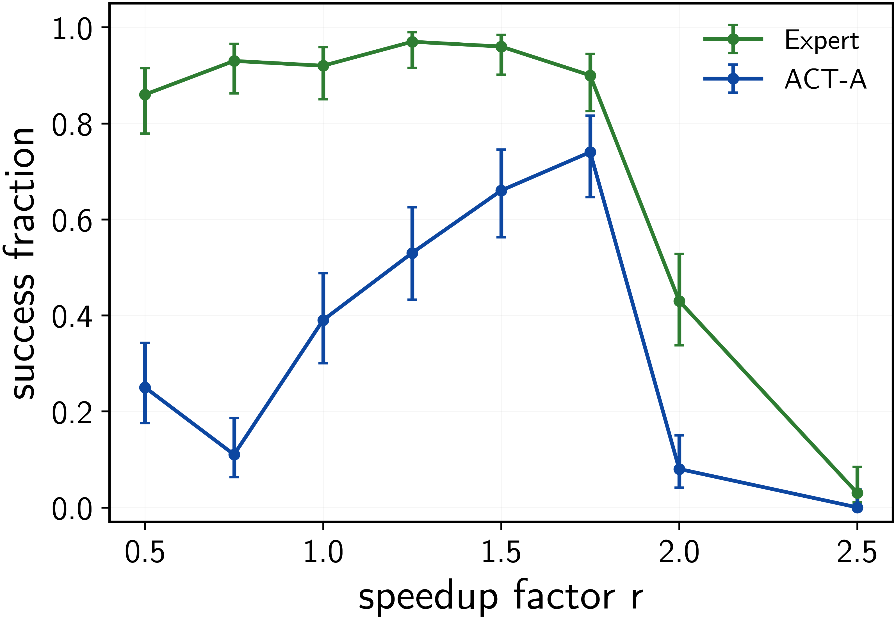
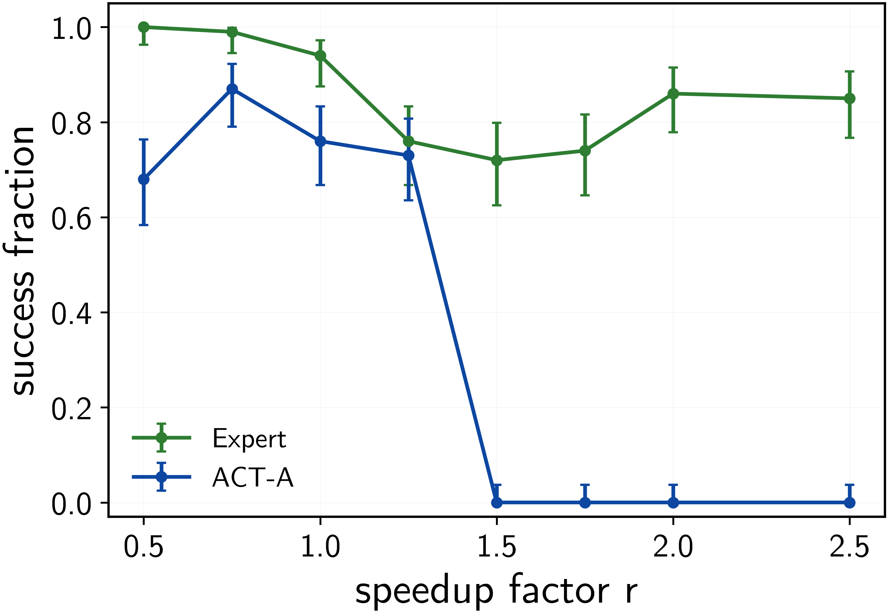

# ParcelStow

Task-rate robustness evaluation for learned dexterous manipulation.

[](https://huggingface.co/datasets/cenwerem/parcelstow)
[](https://arxiv.org/abs/2609.01453)
[](https://github.com/isaac-sim/IsaacLab)

ParcelStow compares an imitation policy with the expert that generated its
demonstrations as task execution speed changes. At each speed, the expert and
policy receive matched initial conditions and use the same task geometry,
success predicates, state observation, and joint-position action interface.
This comparison separates sensitivity to execution speed from a difference in
evaluation conditions.

The release contains three contact-rich manipulation tasks for a fixed-base
Unitree G1 humanoid with a RealHand L6 right hand. Each task has a scripted
expert, a speed range fixed by calibration performed before learner training,
demonstrations sampled from that range, a trained ACT policy, episode records,
and success predicates evaluated from simulator state.

The speedup factor `r` divides the nominal durations of each task's designated
manipulation phases. The acquisition and final settling phases retain fixed
durations, and each policy observes `r`. Evaluation within the demonstrated
range tests performance at speeds represented in the training data;
evaluation outside that range tests speed extrapolation. [Benchmark
Specification](docs/BENCHMARK.md) defines the intervention, matched evaluation,
and statistical reporting used for the original parcel insertion study.

## Outline

- [Task Gallery](#task-gallery)
- [Installation](#installation)
- [Quick Start](#quick-start)
- [Tasks and Evaluation Results](#tasks-and-evaluation-results)
- [Evaluate Your Own Policy](#evaluate-your-own-policy)
- [Repository Map](#repository-map)
- [Benchmark Specification](docs/BENCHMARK.md)
- [Policy Interface](docs/POLICY_INTERFACE.md)
- [Reproducing Our Paper's Results](docs/REPRODUCING_THE_PAPER.md)
- [Data and Checkpoints](docs/DATA_AND_CHECKPOINTS.md)
- [Diagnostics](docs/DIAGNOSTICS.md)
- [Citation](#citation)

## Task Gallery

<table align="center">
  <tr>
    <td align="center" valign="top" width="33%">
      
      <br>
      <sub><b>Parcel Insertion.</b> Acquire and reorient a parcel, then insert it into a receptacle.</sub>
    </td>
    <td align="center" valign="top" width="33%">
      
      <br>
      <sub><b>Upright Placement.</b> Reorient a cuboid to an upright pose and release it at a target region.</sub>
    </td>
    <td align="center" valign="top" width="33%">
      
      <br>
      <sub><b>Keyed Peg Insertion.</b> Reorient and insert a cuboid into a tight container with a 3 mm per-side clearance.</sub>
    </td>
  </tr>
</table>

## Installation
The analysis tier needs Python 3.10+ with NumPy and Matplotlib. The
simulation tiers need [Isaac Lab](https://isaac-sim.github.io/IsaacLab/)
(tested with Isaac Sim 5.1). Install the task extension into the Isaac
Lab Python environment,

```bash
uv pip install -p <isaaclab-venv>/bin/python -e source/parcelstow
```

then run the geometry and simulator-backed physics tests,

```bash
python -m pytest tests/ -q            # pure geometry tests, no simulator
python -m pytest tests/ --isaac -q    # simulator-backed physics tests
```
## Quick Start
### Analyze the Released Records
The repository contains the episode records for all three tasks. Reproduce the
parcel insertion success curve, success table, and paired bootstrap interval,
then regenerate the upright placement and keyed peg insertion curves, with

```bash
python3 -m pip install numpy matplotlib
python3 scripts/reproduce.py envelope
python3 scripts/plot_envelope.py --summary data/records/upright/eval_summary.jsonl \
    --actors expert act --out outputs/upright_operating_envelope
python3 scripts/plot_envelope.py --summary data/records/peg/eval_summary.jsonl \
    --actors expert act --out outputs/peg_operating_envelope
```

This path requires Python, NumPy, and Matplotlib; it does not require Isaac Lab
or a GPU.

### Run the Parcel Insertion Expert
With Isaac Lab installed (see [Installation](#installation)), run the scripted
expert for five episodes,

```bash
python scripts/run_task.py
```

### Evaluate a Released Parcel Insertion Policy
Evaluate the ACT-A checkpoint, fetched from the [Hugging Face
dataset](https://huggingface.co/datasets/cenwerem/parcelstow), at two speeds:

```bash
python scripts/download_artifacts.py --demo     # ACT-A checkpoint
python scripts/evaluate.py --actor act --rates 1.0 2.0 --episodes 100
```

### Reproduce the Complete Evaluation
Retrieve the demonstrations and checkpoints from the consolidated [Hugging
Face dataset](https://huggingface.co/datasets/cenwerem/parcelstow), then follow
[Reproducing the Paper](docs/REPRODUCING_THE_PAPER.md). The evaluation drivers
for the two additional tasks are
`scripts/manipulation/eval_upright_policies.py` and
`scripts/manipulation/eval_peg_policies.py`.

## Tasks and Evaluation Results
Each condition below contains 100 episodes. The expert and ACT policy were evaluated using
the same initial conditions at each execution speed. Points in the success
curves show Wilson 95% confidence intervals.

### Parcel Insertion
The parcel insertion task acquires an 80 × 55 × 40 mm parcel, rotates it by 90
degrees, transports it to an open-front receptacle, and inserts it with 10 mm
of clearance per side along the tight axis. The demonstrated speed range is
`r ∈ [0.5, 2.0]`. The [frozen task
specification](docs/TASK_SPEC.md) defines the phase schedule, distribution over
initial conditions, and success predicates. The expert and ACT-A each succeed in 100 of 100 episodes at `r=1`. At `r=2`,
the expert succeeds in 84 episodes and ACT-A succeeds in 53. The matched
difference in success rate is 31 percentage points, with a paired bootstrap 95%
confidence interval of `[0.18, 0.44]`. Equal success at nominal speed therefore
does not imply equal sensitivity to execution speed. The complete parcel insertion analysis includes stage outcomes, a relative
motion handoff, and force closure measurements, and we define each analysis axix in the [Diagnostics](docs/DIAGNOSTICS.md) section.

<table align="center">
  <tr>
    <td align="center" width="50%">
      
      <br>
      <sub><b>Expert–ACT Contrast.</b> At <code>r=2</code>, the expert completes the task at 8.2 degrees while ACT-A fails to meet the 10-degree maximum orientation error required for task success.</sub>
    </td>
    <td align="center" width="50%">
      
      <br>
      <sub><b>Parcel Insertion Success.</b> Speeds above <code>r=2</code> lie outside the demonstrated range.</sub>
    </td>
  </tr>
</table>

### Upright Placement
The upright placement task acquires a 180 × 55 × 55 mm cuboid that initially
rests on a side face, rotates its long axis to the vertical, transports it to a
circular target region, and releases it. Success requires the cuboid to settle
with its base inside the target region and its final tilt at most 5 degrees.
The demonstrated speed range is `r ∈ [0.75, 1.75]`. The [frozen task
specification](docs/TASK_SPEC_UPRIGHT.md) defines the geometry and predicates. At `r=1`, the expert succeeds in 92 of 100 episodes and ACT succeeds in 39. At
the maximum demonstrated speed, `r=1.75`, the expert succeeds in 90 episodes
and ACT succeeds in 74. ACT does not match the expert at nominal speed, so this
comparison does not isolate sensitivity to execution speed from the difference
in success rate already present at nominal speed.

<table align="center">
  <tr>
    <td align="center" width="50%">
      
      <br>
      <sub><b>Expert–ACT Contrast.</b> At <code>r=1</code>, the expert places the cuboid upright on the target region, while ACT fails, placing the cuboid in the wrong orientation and missing the target region.</sub>
    </td>
    <td align="center" width="50%">
      
      <br>
      <sub><b>Success Across Execution Speeds.</b> Speeds below <code>r=0.75</code> and above <code>r=1.75</code> lie outside the demonstrated range.</sub>
    </td>
  </tr>
</table>

### Keyed Peg Insertion
The keyed peg insertion task uses the same 180 × 55 × 55 mm cuboid. The robot
rotates the cuboid to an upright pose, transports it to a square pocket, and
inserts it through a lead-in funnel into a cavity with 3 mm of clearance per
side. The demonstrated speed range is `r ∈ [0.5, 1.0]`. The [frozen task
specification](docs/TASK_SPEC_PEG.md) defines the pocket geometry and success
predicates. At `r=1`, the expert succeeds in 94 of 100 episodes and ACT succeeds in 76. At every evaluated speed `r ≥ 1.5`, which lies outside the demonstrated range, ACT acquires the peg in 0 of 100 episodes. Because the acquisition phases retain fixed durations, these failures accompany the extrapolated rate input and not a reduction in acquisition time.

<table align="center">
  <tr>
    <td align="center" width="50%">
      
      <br>
      <sub><b>Expert–ACT Contrast.</b> At <code>r=1</code>, the expert completes insertion while ACT drops the peg during transport.</sub>
    </td>
    <td align="center" width="50%">
      
      <br>
      <sub><b>Success Across Execution Speeds.</b> Speeds above <code>r=1</code> lie outside the demonstrated range.</sub>
    </td>
  </tr>
</table>

## Evaluate Your Own Policy
Implement three members, `name`, `reset(ids, obs)`, and
`act(obs) -> (action, q_target)`, over the frozen 147-D state observation
(speedup factor included at index 146) and 16-D joint-position action at
50 Hz. `examples/custom_policy.py` is a complete runnable example,

```bash
python scripts/evaluate.py --actor examples.custom_policy:HoldPosturePolicy \
    --rates 1.0 --episodes 5 --num_envs 8
python scripts/plot_envelope.py --summary outputs/eval/summary.jsonl
```
[docs/POLICY_INTERFACE.md](docs/POLICY_INTERFACE.md) documents the
observation slices, action semantics, reset protocol, and record schema.

## Repository Map
| Path | Content |
|---|---|
| `scripts/run_task.py`, `evaluate.py`, `plot_envelope.py`, `reproduce.py`, `download_artifacts.py` | supported public commands |
| `source/parcelstow/` | Isaac Lab environments, task geometry, phase schedules, and success monitors |
| `scripts/manipulation/` | experiment drivers for parcel insertion, upright placement, and keyed peg insertion |
| `examples/custom_policy.py` | minimal policy showing the integration point |
| `data/records/` | released episode evaluation records |
| `experiments/paper/results/` | frozen derived analyses of the paper |
| `artifacts/manifest.json` | external file inventory with checksums |
| `docs/` | benchmark spec, task spec, interface, reproduction, diagnostics |
| `tests/` | pure geometry tests and simulator-backed physics tests |

## Citation
The accompanying preprint is
[arXiv:2609.01453](https://arxiv.org/abs/2609.01453) \[cs.RO\].

```bibtex
@misc{enwerem2026parcelstow,
  title  = {Does Imitation Learning Preserve Temporal Robustness in Dexterous
            Manipulation? An Expert-Learner Comparison Across Task Execution Speeds},
  author = {Enwerem, Clinton and Baras, John S. and Belta, Calin},
  year   = {2026},
  eprint = {2609.01453},
  archivePrefix = {arXiv},
  primaryClass = {cs.RO},
  url    = {https://arxiv.org/abs/2609.01453}
}
```
