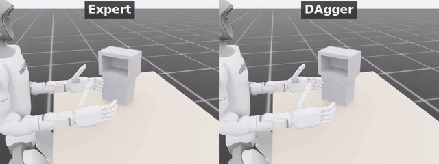
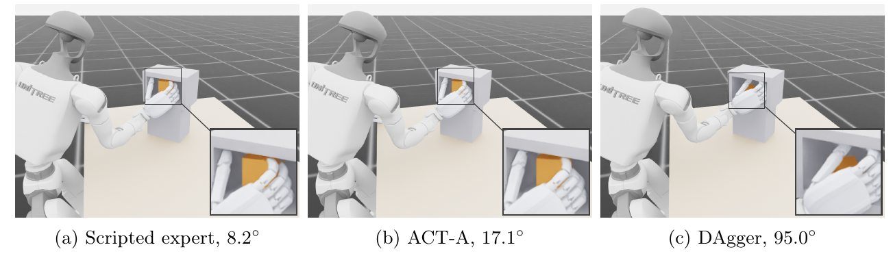
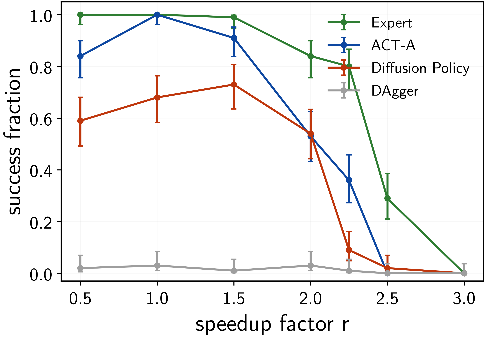

# ParcelStow

Task-rate robustness evaluation for learned dexterous manipulation.

ParcelStow is an Isaac Lab benchmark for measuring whether learned
contact-rich manipulation policies preserve task success as execution
rate increases while task geometry and acquisition timing remain fixed.
A humanoid arm-hand system (Unitree G1 with a RealHand L6 dexterous
hand) acquires a small parcel, reorients it by 90 degrees, and inserts
it into a cubby with 10 mm clearance. ParcelStow varies one quantity,
the requested task rate r, which scales the duration of the manipulation
phase schedule. Every policy reads r in its observation.

A perturbation of one task-intrinsic quantity defines the measurement.
The scene, the object, the friction coefficient, every geometric
reference, and the acquisition timing hold their nominal values while
that quantity varies, and a learner's success curve is compared against
the curve of the expert that supplied its demonstrations at matched
values. Comparing at matched values separates preservation under the
perturbation from a deficit already present at the nominal value. Task
rate is the quantity instantiated here, and success measured over r
traces the task-rate operating envelope.

At r=2 the expert completes the insertion and a DAgger-distilled policy
leaves the parcel on its side against the receptacle wall.

<p align="center">
  
</p>

DAgger completes 3 of 100 episodes at the nominal rate, so it holds no
nominal parity to lose and its behavior at r=2 separates no rate effect
from that deficit. It appears here because its failure is visible in
motion. ACT-A completes 100 of 100 at the nominal rate, and its failure
at r=2 is a 17.1 degree final orientation error against a 10 degree
settling tolerance, panel (b) below.

<p align="center">
  
</p>

Terminal states at r=2, with the receptacle interior magnified. Each
subcaption reports the final parcel orientation error of the displayed
episode against the 10 degree settling tolerance. The three panels come
from separate episodes and show terminal geometry, not a matched
initial-condition comparison.

**The primary result.** ACT-A, trained on the scripted expert's
demonstrations, and the expert both succeed 100/100 at the nominal rate.
At r=2, still inside the ACT training-rate range [0.5, 2], ACT-A succeeds
in 53 of 100 episodes while the expert succeeds in 84.

| | r=1 | r=2 |
|---|---|---|
| Expert | **100/100** | **84/100** |
| ACT-A | **100/100** | **53/100** |

Every cell runs 100 episodes on draws seeded identically for all actors
([docs/BENCHMARK.md](docs/BENCHMARK.md)). A 20000-resample paired
bootstrap over those draws puts the r=2 success gap at [0.18, 0.44] with
95% confidence. The other two seeds lose more over the same rate change,
ACT-B from 70/100 to 36/100 and ACT-C from 62/100 to 14/100, against
100/100 to 84/100 for the expert. ParcelStow measures whether success
holds as the requested rate rises, not whether a policy reproduces the
demonstrated task at its nominal rate.

<p align="center">
  
</p>

| | | |
|---|---|---|
| [Quick start](#quick-start) | [Evaluate your policy](#evaluate-your-policy) | [Reproduce the paper](docs/REPRODUCING_THE_PAPER.md) |
| [Benchmark specification](docs/BENCHMARK.md) | [Data and checkpoints](docs/DATA_AND_CHECKPOINTS.md) | [Citation](#citation) |

## What can I do with ParcelStow?

- **Evaluate a policy over a task-rate grid.** One command runs any
  policy exposing the three-member actor interface over the frozen
  evaluation draws and writes records in the released schema
  ([docs/POLICY_INTERFACE.md](docs/POLICY_INTERFACE.md)).
- **Reproduce the paper's comparisons.** Expert, ACT (three seeds),
  Diffusion Policy, and DAgger, from the released episode records without
  a simulator, or from scratch with Isaac Lab
  ([docs/REPRODUCING_THE_PAPER.md](docs/REPRODUCING_THE_PAPER.md)).
- **Diagnose where failures enter.** Stage outcomes, hand-object motion,
  relative-motion handoffs, and realized-contact measurements localize
  the failure stage per episode
  ([docs/DIAGNOSTICS.md](docs/DIAGNOSTICS.md)).

## Quick start

**Tier 0, no Isaac, no GPU.** The complete episode-level evaluation
records ship in this repository. Reproduce the operating-envelope figure,
the success table, and the gap interval directly from a clone,

```bash
pip install numpy matplotlib
python scripts/reproduce.py envelope
```

**Tier 1, first simulator run.** With Isaac Lab installed
([installation](#installation)), run the scripted expert for five
episodes,

```bash
python scripts/run_task.py
```

**Tier 2, evaluate a policy.** Run a released baseline or your own policy
over rates ([docs/POLICY_INTERFACE.md](docs/POLICY_INTERFACE.md)),

```bash
python scripts/download_artifacts.py --demo     # ACT-A checkpoint
python scripts/evaluate.py --actor act --rates 1.0 2.0 --episodes 100
```

**Tier 3, full reproduction.** Fetch demonstrations and all checkpoints,
or retrain them, then rerun the full evaluation
([docs/REPRODUCING_THE_PAPER.md](docs/REPRODUCING_THE_PAPER.md)).

## Evaluate your policy

Implement three members, `name`, `reset(ids, obs)`, and
`act(obs) -> (action, q_target)`, over the frozen 147-D state observation
(requested rate included at index 146) and 16-D joint-position action at
50 Hz. `examples/custom_policy.py` is a complete runnable example,

```bash
python scripts/evaluate.py --actor examples.custom_policy:HoldPosturePolicy \
    --rates 1.0 --episodes 5 --num_envs 8
python scripts/plot_envelope.py --summary outputs/eval/summary.jsonl
```

[docs/POLICY_INTERFACE.md](docs/POLICY_INTERFACE.md) documents the
observation slices, action semantics, reset protocol, and record schema.

## Installation

The analysis tier needs Python 3.10+ with numpy and matplotlib. The
simulation tiers need [Isaac Lab](https://isaac-sim.github.io/IsaacLab/)
(tested with Isaac Sim 5.1). Install the task extension into the Isaac
Lab Python environment,

```bash
uv pip install -p <isaaclab-venv>/bin/python -e source/parcelstow
```

then verify with the physical-integrity tests,

```bash
python -m pytest tests/ -q            # pure geometry tests, no simulator
python -m pytest tests/ --isaac -q    # simulator-backed physics tests
```

## Repository map

| path | content |
|---|---|
| `scripts/run_task.py`, `evaluate.py`, `plot_envelope.py`, `reproduce.py`, `download_artifacts.py` | supported public commands |
| `source/parcelstow/` | the Isaac Lab extension, task, geometry, monitor |
| `scripts/manipulation/` | the validated experiment drivers behind the public commands |
| `examples/custom_policy.py` | minimal policy showing the integration point |
| `data/records/` | released episode-level evaluation records |
| `experiments/paper/results/` | frozen derived analyses of the paper |
| `artifacts/manifest.json` | external artifact inventory with checksums |
| `docs/` | benchmark spec, task spec, interface, reproduction, diagnostics |
| `tests/` | pure geometry tests and simulator-backed physics tests |

## Citation

The accompanying preprint is in preparation. The arXiv identifier will
appear here and in `CITATION.cff` once assigned.

```bibtex
@misc{enwerem2026parcelstow,
  title  = {ParcelStow: Task-Rate Robustness Evaluation for Learned
            Dexterous Manipulation},
  author = {Enwerem, Clinton},
  year   = {2026},
  note   = {arXiv identifier pending}
}
```
