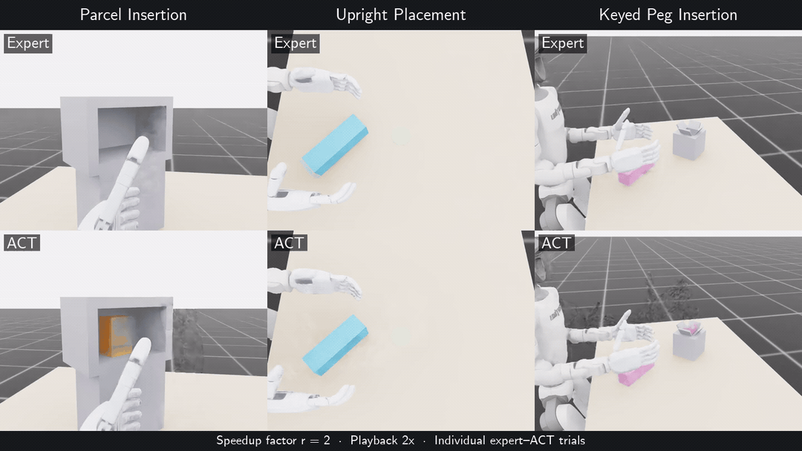
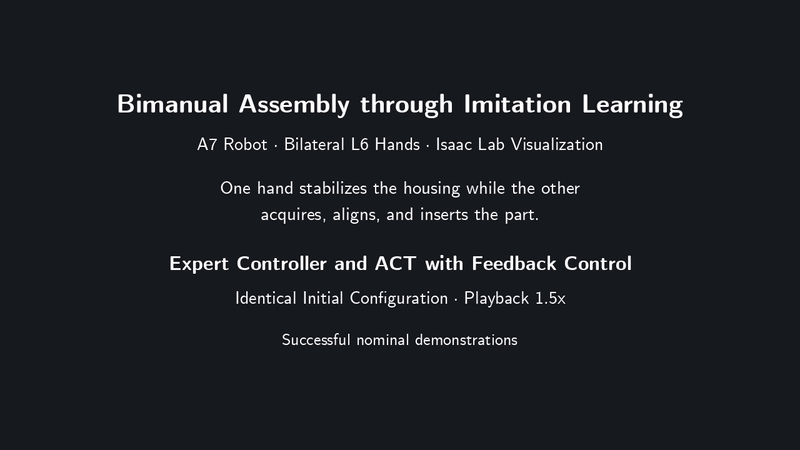

# ParcelStow

## Does Imitation Learning Preserve Robustness Under Execution-Timing Variation?

ParcelStow evaluates how the performance difference between an imitation
learner and its expert varies with task conditions. Three simulated
manipulation tasks instantiate this comparison through variation in execution timing.

**3 tasks · 970,565 demonstration control steps · scripted experts + ACT, DP, and DAgger checkpoints ·
canonical evaluation records · one policy interface · CPU-only result reproduction from records**

[](https://github.com/coenwerem/parcelstow/actions/workflows/ci.yml)
[](LICENSE)
[](https://isaac-sim.github.io/IsaacLab/)
[](https://arxiv.org/abs/2609.01453)
[](https://huggingface.co/datasets/cenwerem/parcelstow)

[**Project Page**](https://clintonenwerem.com/parcelstow/) ·
[**Paper**](https://arxiv.org/abs/2609.01453) ·
[**Dataset**](https://huggingface.co/datasets/cenwerem/parcelstow) ·
[**Runbook**](docs/RUNBOOK.md) ·
[**Install**](#installation) ·
[**Reproduce Results on CPU**](#reproduce-results-from-evaluation-records) ·
[**Evaluate a Policy**](docs/POLICY_INTERFACE.md) ·
[**Submit Policy Results**](RESULTS.md#submit-a-policy-result)

**Support ParcelStow:** [★ Star on GitHub](https://github.com/coenwerem/parcelstow) ·
[♥ Like on Hugging Face](https://huggingface.co/datasets/cenwerem/parcelstow)

## Expert–ACT Comparison

[](https://huggingface.co/datasets/cenwerem/parcelstow/resolve/main/videos/expert_act_comparison.mp4)

Expert on the top row; ACT below. Each column shows one task at speedup
factor `r=2`, played at 2× speed. The ACT recordings use the checkpoints
reported below. Labels identify each recorded outcome.

We also extend ParcelStow to bimanual assembly. In the demonstrated trials,
the expert completes assembly in **54.74 s**, and **ACT with feedback control**
in **58.80 s**, a **4.06 s** difference from identical initial configurations.
The expert moves more smoothly; ACT exhibits visibly jerky, stop–start motion.
See the demo in [Bimanual Assembly Extension](#bimanual-assembly-extension).

[Watch the full-resolution video](https://huggingface.co/datasets/cenwerem/parcelstow/resolve/main/videos/expert_act_comparison.mp4).

## Execution Timing and Task Success

A scalar speedup factor `r` divides the nominal durations of selected task
phases while acquisition and settling retain fixed durations. At `r=1`, the
schedule is nominal; at `r=2`, the scaled phases have half their nominal
duration. Expert and learner policies are evaluated over the same factor grid.

### Nominal and Scaled-Speed Task Success

| Task | Expert at `r=1` | ACT at `r=1` | Higher `r` | Expert | ACT |
|---|---:|---:|---:|---:|---:|
| Parcel insertion | **100/100** | **100/100** | 2 | **84/100** | **53/100** |
| Upright placement | **185/200** | **194/200** | 2 | **105/200** | **24/200** |
| Keyed peg insertion | **182/200** | **191/200** | 1.5 | **150/200** | **3/200** |

Each ACT column reports one trained policy per task. Expert-minus-ACT
differences at the highlighted factors are 31, 40.5, and 73.5 percentage points,
with pointwise 95% paired bootstrap intervals `[18,44]`, `[32,49]`, and
`[67.5,79.5]`. Parcel `r=2` is within its demonstrated range; upright `r=2`
and peg `r=1.5` are outside theirs. Training replications are reported
individually in the evaluation records.

Diffusion Policy (DP) nominal success is 68/100, 181/200, and 95/200 on parcel,
upright, and peg. Its parcel results support standalone success rates because
episode-level pairing and distribution matching with the expert are not
established. DAgger nominal success is 3/100, 1/200, and 0/200; these results
support failure characterization but not execution-speed degradation claims.
The record catalogs provide task-stage counts, terminal failures, hashes,
pairing restrictions, and excluded series.

## Get the Code

Clone `main` to use the current three-task benchmark:

```bash
git clone --branch main https://github.com/coenwerem/parcelstow.git
cd parcelstow
```

## Installation

Simulator execution requires Isaac Lab and a supported NVIDIA GPU. From the
repository root, install the extension into the Isaac Lab Python environment:

```bash
uv pip install -p <isaaclab-venv>/bin/python -e source/parcelstow
```

Simulator records use Python 3.11.14, Isaac Sim 5.1.0, Isaac Lab 0.54.2, PyTorch 2.7.0+cu128, SciPy 1.15.3, and NumPy 1.26.4 on an RTX 5070 Ti. Upright/peg ACT training used Python 3.12.3, PyTorch 2.8.0+cu128, and NumPy 2.3.5. The [runbook](docs/RUNBOOK.md#5-environments-and-fresh-output-directories) distinguishes the environments.

Run direct module tests without Isaac Lab:

```bash
python -m pytest tests/ -q
```

Run the simulator groups in separate processes:

```bash
python -m pytest tests/test_parcel_physics.py tests/test_relative_handoff.py --isaac -q
python -m pytest tests/test_upright_physics.py --isaac-upright -q
python -m pytest tests/test_peg_physics.py --isaac-peg -q
```

## Run a Task

Change only `--task` to run another scripted expert:

```bash
python scripts/run_task.py --task parcel
python scripts/run_task.py --task upright
python scripts/run_task.py --task peg
```

Evaluate the released experts through the same public interface:

```bash
python scripts/evaluate.py --task parcel --actor expert
python scripts/evaluate.py --task upright --actor expert
python scripts/evaluate.py --task peg --actor expert
```

The `--task` value selects one task: `parcel` selects parcel insertion,
`upright` selects upright placement, and `peg` selects keyed peg insertion.
The canonical checkpoint bundle is explicit:

```bash
python3 scripts/download_artifacts.py --manuscript
python3 scripts/download_artifacts.py --manuscript --verify
```

For an offline copy from a local Hugging Face checkout, add
`--local-hf ../parcelstow-hf`. Use the
[runbook evaluation commands](docs/RUNBOOK.md#6-evaluate-the-frozen-checkpoints)
with the listed checkpoint paths, episode counts, factor grids, and bank seeds.
The short commands above are for trying the interface; the runbook specifies
the complete evaluation configuration.

## Evaluation Records

The [canonical inventory](data/manuscript_20260921/MANUSCRIPT_EVIDENCE.csv)
and [artifact index](data/manuscript_20260921/ARTIFACT_INDEX.csv) identify each
condition, checkpoint, and dataset. The [record guide](data/manuscript_20260921/README.md)
explains how to resolve original source paths and interpret pairing status.
Task specifications: [parcel](docs/TASK_SPEC.md), [upright](docs/TASK_SPEC_UPRIGHT.md),
and [peg](docs/TASK_SPEC_PEG.md).

## Reproduce Results from Evaluation Records

Recompute the canonical counts, stages, failures and pairing checks without
Isaac Lab or a GPU:

```bash
python3 scripts/reproduce_manuscript.py --output-dir outputs/reproduce/canonical
```

Add `--bootstrap` with NumPy installed for 20,000-resample paired intervals.
The expected audit covers 136 conditions and 20 source series. The output
path must be new. See the [detailed runbook](docs/RUNBOOK.md) for environment setup,
training, checkpoint selection, evaluation and all dataset/record locations.

## Evaluate a Custom Policy on All Tasks

The same Python class can be loaded for every task:

```bash
python scripts/evaluate.py --task parcel --actor examples.custom_policy:HoldPosturePolicy --rates 1 --episodes 5
python scripts/evaluate.py --task upright --actor examples.custom_policy:HoldPosturePolicy --rates 1 --episodes 5
python scripts/evaluate.py --task peg --actor examples.custom_policy:HoldPosturePolicy --rates 1 --episodes 5
```

All tasks produce a 147-dimensional state observation and accept a 16-dimensional normalized joint-position action at 50 Hz. Task identity is selected by `--task`; it is not appended to the observation. Observation index 146 contains `r`. The pose slice at indices 118:125 represents `parcel_pose` for parcel insertion and `object_pose` for upright placement and keyed peg insertion. Phase values retain task-specific schedules. [Policy Interface](docs/POLICY_INTERFACE.md) documents every slice and the adapter boundary.

`HoldPosturePolicy` commands the default posture and normally fails. It demonstrates loading and record generation, not task performance.

## Data, Checkpoints, and Videos

The [Hugging Face repository](https://huggingface.co/datasets/cenwerem/parcelstow)
organizes demonstrations, training tensors, checkpoints, evaluation records,
and videos by artifact role. The `manuscript_20260921` directories contain
the checkpoints, records, and illustrations used for the three-task results.

[artifacts/manifest.json](artifacts/manifest.json) records download paths, sizes
and SHA-256. [Data and Checkpoints](docs/DATA_AND_CHECKPOINTS.md) and the
[runbook](docs/RUNBOOK.md) identify the files used by each training and evaluation command.

## Bimanual Assembly Extension

[](https://clintonenwerem.com/videos/bimanual_expert_act_demo.mp4)

The bimanual extension uses the A7 robot with bilateral L6 hands.
One hand stabilizes the housing while the other acquires, aligns, and inserts
the part. The video compares an expert controller with ACT and feedback control
from identical initial configurations, visualized in Isaac Lab at 1.5× playback.
Both complete assembly, with visibly smoother expert motion and more intermittent
ACT motion during the approach and insertion.

[**Watch the video**](https://clintonenwerem.com/videos/bimanual_expert_act_demo.mp4) ·
[**Repository copy**](media/extensions/a7_l6_bimanual_expert_act.mp4)

## Contributing

[Policy Results](RESULTS.md) lists the included baselines and defines the
evidence required to submit another policy. [Contributing](CONTRIBUTING.md)
distinguishes bug reports, policy results, policy integrations, candidate
tasks, and changes to fixed definitions. [Candidate Task Authoring
Protocol](docs/TASK_AUTHORING.md) defines the scientific and software evidence
required before a task can be listed as part of ParcelStow.

## Repository Map

| Path | Content |
|---|---|
| `scripts/run_task.py`, `scripts/evaluate.py` | public simulator commands for all three tasks |
| `scripts/reproduce_manuscript.py` | canonical counts, intervals, and pairing from frozen records |
| `docs/RUNBOOK.md` | training, evaluation, environments, and artifact locations |
| `scripts/task_registry.py` | task aliases, gym IDs, defaults, stage keys, experts, monitors, and schedules |
| `source/parcelstow/` | Isaac Lab extension and task definitions |
| `data/manuscript_20260921/` | canonical records, pairing, exclusions, artifact index and provenance |
| `examples/custom_policy.py` | one policy class loadable on all tasks |
| `RESULTS.md` | included baselines and policy-result submission requirements |
| `docs/` | current benchmark, policy, reproduction, contribution, and task specifications |

## Citation

Cite the accompanying preprint:

```bibtex
@misc{enwerem2026parcelstow,
  title         = {Does Imitation Learning Preserve Temporal Robustness in Dexterous Manipulation? An Expert-Learner Comparison Across Task Execution Speeds},
  author        = {Enwerem, Clinton and Baras, John S. and Belta, Calin},
  year          = {2026},
  eprint        = {2609.01453},
  archivePrefix = {arXiv},
  primaryClass  = {cs.RO},
  url           = {https://arxiv.org/abs/2609.01453}
}
```

A software citation is available in [CITATION.cff](CITATION.cff).
